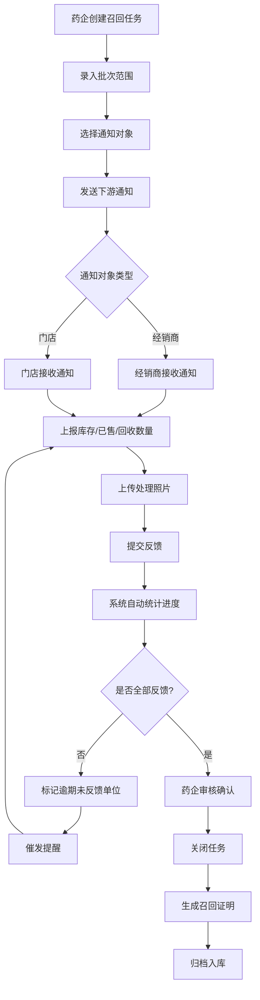
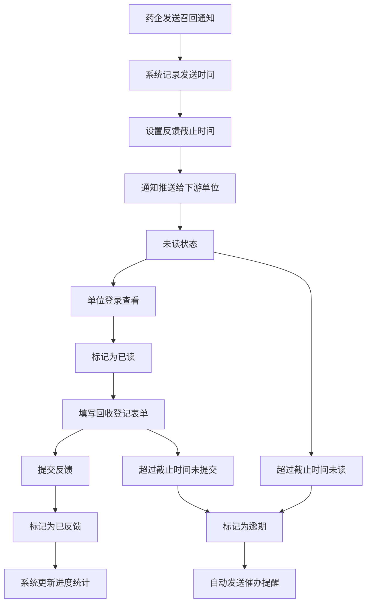

## 1. 产品概述

药品召回协同 Web 应用，为药企、经销商和门店提供一站式问题药品批次协同处理平台。通过标准化流程管理，实现召回任务从创建、通知、执行到归档的全链路追踪，提升召回效率，降低用药风险。

## 2. 核心功能

### 2.1 用户角色

| 角色 | 说明 | 核心权限 |
|------|------|----------|
| 药企 | 药品生产企业，召回发起方 | 创建召回任务、填写召回原因、设置风险等级、定义目标批号、选择通知对象、跟踪已读状态、查看整体进度、任务关闭、导出召回证明、历史任务检索 |
| 经销商 | 药品批发/配送企业，中间流转方 | 接收召回通知、上报库存数量、上报已售数量、上报回收数量、上传处理照片、补充说明 |
| 门店 | 药品零售终端，最终销售端 | 接收召回通知、上报库存数量、上报已售数量、上报回收数量、上传处理照片、补充说明 |

### 2.2 功能模块

1. **召回任务管理**：任务列表、创建任务、任务详情、状态跟踪
2. **批次范围管理**：目标批号录入、批次信息维护、受影响产品清单
3. **下游通知管理**：通知对象选择、通知发送、已读状态跟踪、催发提醒
4. **回收登记管理**：库存/已售/回收数量上报、处理照片上传、补充说明
5. **进度看板**：按地区统计、按渠道统计、整体进度、逾期单位标记
6. **结果归档**：任务关闭、召回证明导出、历史任务检索、召回记录查看

### 2.3 页面详情

| 页面名称 | 模块名称 | 功能描述 |
|-----------|-------------|---------------------|
| 召回任务 | 任务列表 | 展示所有召回任务卡片，支持按状态、风险等级、时间筛选搜索 |
| 召回任务 | 创建任务 | 表单填写召回原因、风险等级（高/中/低）、目标批号范围、召回说明 |
| 召回任务 | 任务详情 | 展示任务完整信息，包含批次列表、通知进度、回收统计、操作日志 |
| 批次范围 | 批次列表 | 展示召回涉及的所有批次信息，包含生产批号、生产日期、有效期、数量 |
| 批次范围 | 批次录入 | 单个或批量录入召回批次信息，支持 Excel 导入 |
| 下游通知 | 通知列表 | 展示所有通知对象及其状态（未读/已读/已反馈/逾期） |
| 下游通知 | 发送通知 | 选择需要通知的经销商和门店，批量发送召回通知 |
| 下游通知 | 已读跟踪 | 实时跟踪通知已读情况，对未读单位进行催发 |
| 回收登记 | 回收列表 | 展示所有单位的回收上报记录，支持按地区、角色筛选 |
| 回收登记 | 上报表单 | 填写库存数量、已售数量、回收数量，上传处理现场照片，添加补充说明 |
| 进度看板 | 统计概览 | 关键指标卡片展示（应反馈数、已反馈数、逾期数、回收完成率） |
| 进度看板 | 地区统计 | 按省市维度统计各地区召回完成进度，地图/列表展示 |
| 进度看板 | 渠道统计 | 按经销商/门店渠道统计召回进度，柱状图/饼图展示 |
| 进度看板 | 逾期预警 | 列表展示逾期未反馈单位，支持快速催办 |
| 结果归档 | 任务管理 | 展示已完成/已关闭的召回任务，支持重新打开 |
| 结果归档 | 证明导出 | 生成并导出 PDF 格式的召回完成证明，包含完整统计数据 |
| 结果归档 | 历史检索 | 多条件组合搜索历史召回任务，支持按时间、药品、风险等级筛选 |

## 3. 核心流程

### 3.1 召回处理主流程

### 3.2 通知与反馈流程

## 4. 用户界面设计

### 4.1 设计风格

- **设计基调**：专业严谨的医疗健康行业风格，强调信任感和专业性
- **主色调**：医疗蓝 `#1E6FBA`（代表专业、信任、医疗）
- **辅助色**：
  - 风险红 `#E53935`（高风险、紧急、错误）
  - 警示橙 `#FB8C00`（中风险、警告、待处理）
  - 安全绿 `#43A047`（低风险、正常、已完成）
  - 信息灰 `#546E7A`（中性信息、辅助文字）
- **中性色**：以 Slate 色系为基础，从 `#F8FAFC` 到 `#0F172A`
- **按钮风格**：圆角 6px，悬浮状态有轻微阴影和颜色加深
- **字体**：标题使用 "Noto Sans SC" 600 权重，正文使用 "Noto Sans SC" 400 权重，数字使用等宽字体增强可读性
- **布局风格**：侧边栏导航 + 顶部操作栏 + 卡片式内容区，强调信息层级
- **图标风格**：使用 Lucide 线性图标，保持简洁一致

### 4.2 页面设计概览

| 页面名称 | 模块名称 | UI 元素 |
|-----------|-------------|-------------|
| 召回任务 | 任务列表 | 卡片式布局，每个卡片展示任务名称、风险等级标签、状态标签、进度条、创建时间、操作按钮 |
| 召回任务 | 创建表单 | 分区表单，包含基本信息区、批次信息区、通知设置区，支持分步填写 |
| 批次范围 | 批次列表 | 数据表格，支持排序、筛选、批量操作，行悬浮显示操作按钮 |
| 下游通知 | 通知列表 | 带状态标签的列表，已读/未读/已反馈/逾期用不同颜色区分 |
| 回收登记 | 上报表单 | 分栏布局，左侧数字输入框（库存/已售/回收），右侧照片上传区 |
| 进度看板 | 统计概览 | 大号数字卡片，带趋势箭头，背景色根据指标状态变化 |
| 进度看板 | 图表区 | 组合图表，上方进度环，下方柱状图，支持数据钻取 |
| 结果归档 | 历史列表 | 时间线布局，左侧时间轴，右侧任务卡片，支持展开查看详情 |

### 4.3 响应式设计

- **桌面优先**：针对 1440px 及以上屏幕优化，侧边栏固定宽度 240px
- **平板适配**：1024px 时侧边栏收起为图标模式，内容区自适应
- **移动适配**：768px 以下侧边栏变为底部抽屉式导航，表格转为卡片列表
- **触控优化**：移动端按钮最小尺寸 44x44px，输入框增加内边距

### 4.4 动效与交互

- **页面加载**：内容区域淡入，卡片依次上浮出现（stagger 动画）
- **状态变化**：风险等级、通知状态变化时有颜色过渡动画
- **数据更新**：统计数字变化时使用滚动数字动画
- **表单交互**：输入框聚焦时边框高亮，提交按钮有 loading 状态
- **悬停效果**：卡片悬浮时轻微上浮并增加阴影，表格行高亮
