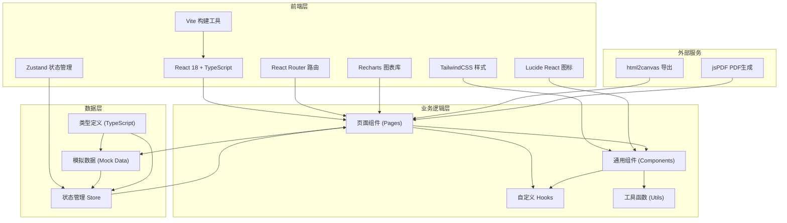
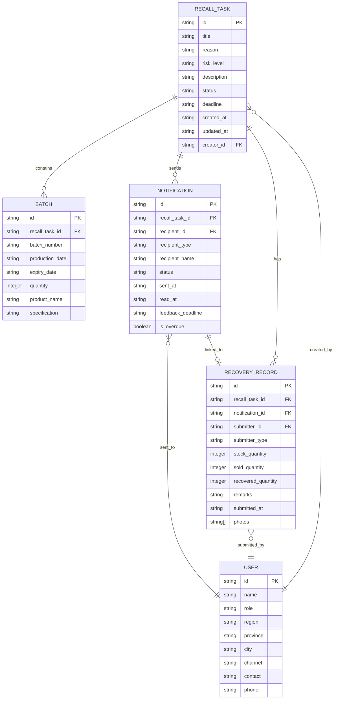

## 1. 架构设计



## 2. 技术描述

### 2.1 前端技术栈
- **框架**: React 18 + TypeScript
- **构建工具**: Vite 5.x
- **路由管理**: React Router DOM v6
- **状态管理**: Zustand 4.x
- **样式方案**: TailwindCSS 3.x
- **图标库**: Lucide React
- **图表库**: Recharts 2.x
- **导出功能**: html2canvas + jsPDF
- **包管理器**: npm

### 2.2 项目初始化
使用 `vite-init` 脚手架创建 React + TypeScript 项目，包含内置的 React Router、TailwindCSS 和 Zustand 支持。

### 2.3 数据方案
本项目采用纯前端方案，使用 TypeScript 类型定义数据结构，通过 Mock 数据模拟真实业务场景。状态管理使用 Zustand 实现全局状态共享，支持页面间数据联动。

## 3. 路由定义

| 路由路径 | 页面名称 | 权限角色 | 说明 |
|-------|---------|----------|------|
| `/` | 召回任务列表 | 全部 | 首页，展示所有召回任务 |
| `/recalls/create` | 创建召回任务 | 药企 | 创建新的召回任务 |
| `/recalls/:id` | 召回任务详情 | 全部 | 查看单个召回任务的完整信息 |
| `/batches` | 批次范围 | 全部 | 管理召回批次信息 |
| `/notifications` | 下游通知 | 全部 | 查看和管理通知发送情况 |
| `/recovery` | 回收登记 | 经销商/门店 | 上报回收数据 |
| `/recovery/list` | 回收列表 | 药企 | 查看所有回收上报记录 |
| `/dashboard` | 进度看板 | 药企 | 查看召回进度统计和分析 |
| `/archive` | 结果归档 | 药企 | 历史任务管理和证明导出 |

## 4. 数据模型

### 4.1 ER 图



### 4.2 数据类型定义

```typescript
// 角色类型
type UserRole = 'pharma' | 'distributor' | 'store';

// 风险等级
type RiskLevel = 'high' | 'medium' | 'low';

// 任务状态
type TaskStatus = 'draft' | 'pending' | 'in_progress' | 'completed' | 'closed';

// 通知状态
type NotificationStatus = 'unread' | 'read' | 'submitted' | 'overdue';

// 召回任务
interface RecallTask {
  id: string;
  title: string;
  reason: string;
  riskLevel: RiskLevel;
  description: string;
  status: TaskStatus;
  deadline: string;
  createdAt: string;
  updatedAt: string;
  creatorId: string;
}

// 批次信息
interface Batch {
  id: string;
  recallTaskId: string;
  batchNumber: string;
  productionDate: string;
  expiryDate: string;
  quantity: number;
  productName: string;
  specification: string;
}

// 通知记录
interface Notification {
  id: string;
  recallTaskId: string;
  recipientId: string;
  recipientType: UserRole;
  recipientName: string;
  region: string;
  province: string;
  city: string;
  status: NotificationStatus;
  sentAt: string;
  readAt: string | null;
  feedbackDeadline: string;
  isOverdue: boolean;
}

// 回收记录
interface RecoveryRecord {
  id: string;
  recallTaskId: string;
  notificationId: string;
  submitterId: string;
  submitterType: UserRole;
  submitterName: string;
  region: string;
  stockQuantity: number;
  soldQuantity: number;
  recoveredQuantity: number;
  remarks: string;
  submittedAt: string;
  photos: string[];
}

// 用户信息
interface User {
  id: string;
  name: string;
  role: UserRole;
  region: string;
  province: string;
  city: string;
  channel: string;
  contact: string;
  phone: string;
}

// 统计数据
interface DashboardStats {
  totalTasks: number;
  pendingTasks: number;
  completedTasks: number;
  totalNotifications: number;
  readNotifications: number;
  submittedRecords: number;
  overdueNotifications: number;
  totalRecoveryRate: number;
}

// 地区统计
interface RegionStats {
  province: string;
  city: string;
  totalUnits: number;
  respondedUnits: number;
  responseRate: number;
  totalStock: number;
  totalRecovered: number;
  recoveryRate: number;
}

// 渠道统计
interface ChannelStats {
  channel: string;
  role: UserRole;
  totalUnits: number;
  respondedUnits: number;
  responseRate: number;
  totalStock: number;
  totalRecovered: number;
  recoveryRate: number;
}
```

## 5. 项目目录结构

```
c:\TraeProjects\1003/
├── .trae/
│   └── documents/
│       ├── prd.md
│       └── tech-architecture.md
├── src/
│   ├── components/          # 通用组件
│   │   ├── Layout/          # 布局组件
│   │   │   ├── Sidebar.tsx
│   │   │   ├── Header.tsx
│   │   │   └── Layout.tsx
│   │   ├── common/          # 基础组件
│   │   │   ├── Button.tsx
│   │   │   ├── Card.tsx
│   │   │   ├── Input.tsx
│   │   │   ├── Badge.tsx
│   │   │   ├── ProgressBar.tsx
│   │   │   ├── Modal.tsx
│   │   │   ├── Table.tsx
│   │   │   ├── StatusTag.tsx
│   │   │   └── RiskBadge.tsx
│   │   └── features/        # 业务组件
│   │       ├── RecallCard.tsx
│   │       ├── BatchTable.tsx
│   │       ├── NotificationList.tsx
│   │       ├── RecoveryForm.tsx
│   │       ├── StatsCard.tsx
│   │       ├── RegionChart.tsx
│   │       └── ChannelChart.tsx
│   ├── pages/               # 页面组件
│   │   ├── RecallList.tsx
│   │   ├── RecallCreate.tsx
│   │   ├── RecallDetail.tsx
│   │   ├── BatchManagement.tsx
│   │   ├── NotificationManagement.tsx
│   │   ├── RecoverySubmit.tsx
│   │   ├── RecoveryList.tsx
│   │   ├── Dashboard.tsx
│   │   └── Archive.tsx
│   ├── store/               # 状态管理
│   │   ├── useRecallStore.ts
│   │   ├── useBatchStore.ts
│   │   ├── useNotificationStore.ts
│   │   ├── useRecoveryStore.ts
│   │   └── useUserStore.ts
│   ├── data/                # 模拟数据
│   │   ├── mockRecalls.ts
│   │   ├── mockBatches.ts
│   │   ├── mockNotifications.ts
│   │   ├── mockRecoveryRecords.ts
│   │   └── mockUsers.ts
│   ├── types/               # 类型定义
│   │   └── index.ts
│   ├── utils/               # 工具函数
│   │   ├── dateUtils.ts
│   │   ├── exportUtils.ts
│   │   ├── statsUtils.ts
│   │   └── formatUtils.ts
│   ├── hooks/               # 自定义 Hooks
│   │   ├── useAuth.ts
│   │   ├── useStats.ts
│   │   └── useExport.ts
│   ├── App.tsx
│   ├── main.tsx
│   ├── router.tsx
│   └── index.css
├── public/
├── package.json
├── tsconfig.json
├── vite.config.ts
├── tailwind.config.js
└── postcss.config.js
```

## 6. 状态管理设计

### 6.1 Zustand Store 结构

```typescript
// 召回任务 Store
interface RecallState {
  recalls: RecallTask[];
  currentRecall: RecallTask | null;
  loading: boolean;
  error: string | null;
  fetchRecalls: () => void;
  fetchRecallById: (id: string) => void;
  createRecall: (data: Partial<RecallTask>) => void;
  updateRecall: (id: string, data: Partial<RecallTask>) => void;
  closeRecall: (id: string) => void;
  getFilteredRecalls: (filters: object) => RecallTask[];
}

// 通知 Store
interface NotificationState {
  notifications: Notification[];
  loading: boolean;
  fetchNotifications: (recallTaskId?: string) => void;
  sendNotifications: (recallTaskId: string, recipientIds: string[]) => void;
  markAsRead: (id: string) => void;
  sendReminder: (id: string) => void;
  checkOverdue: () => void;
}

// 回收记录 Store
interface RecoveryState {
  records: RecoveryRecord[];
  loading: boolean;
  fetchRecords: (recallTaskId?: string) => void;
  submitRecord: (data: Partial<RecoveryRecord>) => void;
  getRecordsByRegion: () => RegionStats[];
  getRecordsByChannel: () => ChannelStats[];
}

// 用户 Store
interface UserState {
  currentUser: User | null;
  users: User[];
  login: (userId: string) => void;
  logout: () => void;
  getUsersByRole: (role: UserRole) => User[];
  getUsersByRegion: (region: string) => User[];
}
```
